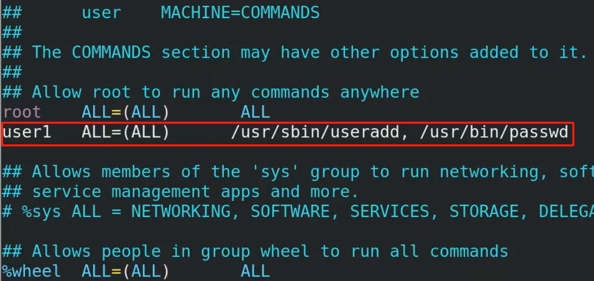
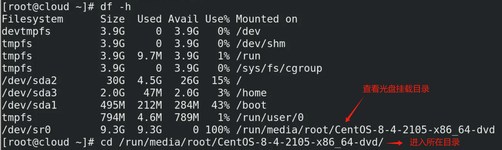
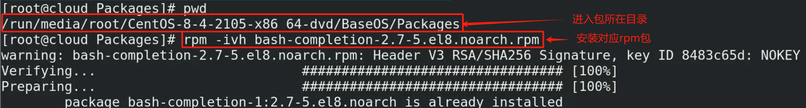
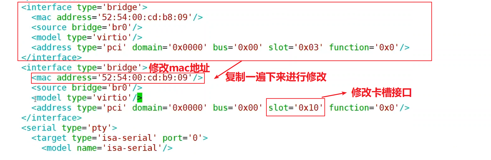
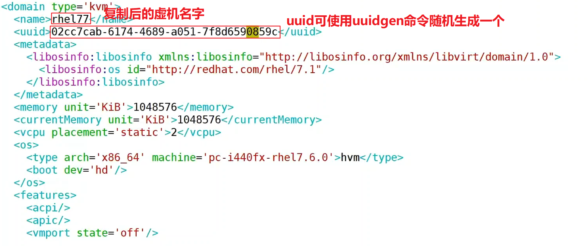
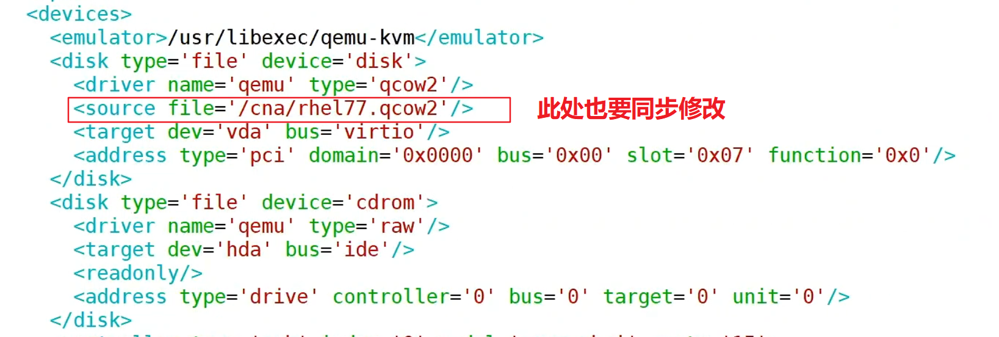
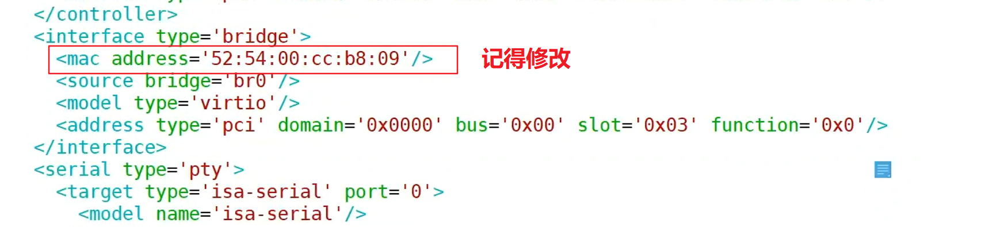
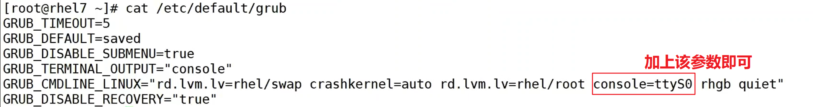

### 基本命令

#### 1、sudoers

修改vim /etc/sudoers，添加如下

```bash
vim /etc/sudoers #赋予可执行命令的绝对路径，多个命令使用空格分隔（逗号后加空格为了美观，无冲突）
```



#### 2、安装tab键无法补全部分系统命令的rpm包





#### 3、KVM

##### 1）嵌套安装虚拟机

```bash
yum groupinstall "Virtualization Host" "Virtualization Hypervisor" "Virtualization Tools" #安装kvm需要的软件包
yum install virt-manager #安装kvm图形管理器
systemctl enable libvirtd --now #设置开机自启并立即启动
virt-manager #打开图形管理器
cd /cna #进入要创建精简磁盘的目录
qemu-img create -f qcow2 server1.qcow2 200g -o preallocation=metadata #kvm默认磁盘类型为qcow2,创建空的并且设置预留为200g的磁盘
```

##### 2）ens33做上行链路(不配置地址，配置地址到网桥上)

```bash
cd /etc/sysconfig/network-script/
vim ifcfg-ens33

TYPE=Ethernet
NAME=ens33
DEVICE=ens33
ONBOOT=yes
BRIDGE=br0
```

##### 3）使用bridge做桥

```bash
cd /etc/sysconfig/network-script/
cp ifcfg-ens33 ifcfg-br0
vim ifcfg-br0

TYPE=Bridge
NAME=br0
DEVICE=br0
ONBOOT=yes
IPADDR=192.168.0.166
NETMASK=255.255.255.0
BOOTPROTO=none
GATEWAY=192.168.0.1
DNS1=114.114.114.114

systemctl restart NetworkManager
nmcli con reload
nmcli con down ens33
nmcli con up ens33
nmcli con down br0
nmcli con up br0
ipconfig #查看ip地址是否在br0上面
```

##### 4）virsh虚拟机操作命令

```bash
virsh list --all #查看所有虚拟机状态
virsh shutdown 虚拟机名称 #正常关机
virsh autostart 虚拟机名称 #跟随宿主机状态自动开机
virsh reboot 虚拟机名称 #重启虚拟机
virsh destory 虚拟机名称 #1s内强制关机
```

##### 5）给kvm里面嵌套的虚拟机添加网卡

```bash
cd /etc/libvirt/qemu
vim 虚拟机名称.xml #修改虚拟配置文件
```



##### 6）kvm里面克隆虚拟机

```bash
cd /磁盘挂载目录（存放虚机磁盘文件） #将/dev/sdb2挂载到/CNA1目录后，在该目录创建了一个qcow2的精简磁盘
cd /etc/libvirt/qemu #kvm内置虚机的配置存放路径
cp 虚拟机名称.xml 新虚拟机名称.xml #修改虚拟配置文件
```







```bash
systemctl restart libvirtd
systemctl start 新的虚拟机名称 
```

##### 7）配置kvm虚拟机以console方式登录

vim /etc/default/grub



然后执行如下

```bash
grub2-mkconfig -o /boot/grub2/grub.cfg
reboot
virsh console 新的虚拟机名称 #想要退出console界面用exit不行，使用ctrl+] 即可退出
```

##### 8）使用命令行安装虚拟机

安装virt-install

```bash
yum provides "*/virt-install"
yum provides "*/virt-viewer"
yum -y install virt-install virt-viewer #virt-install是安装工具，virt-viewer是图形化界面
cd /CNA1
qemu-img create -f qcow2 server11.qcow2 300G -o preallocation=metadata
virt-install --name server11 --memory 1024 --vcpus 2 --cdrom iso镜像的绝对路径 --disk /CNA1/server11.qcow2 --network bridge=br0 --vnc
```

#### 4、公有云

##### 1）弹性云服务器ECS

**region（区域）、AZ（可用区）**

同一区域的可用区之间是互通的，不同区域的可用区之间不互通

##### 2）VPC

**VPC、子网、对等连接**

不同VPC之间物理隔离，同一VPC子网之间是互通的

不同VPC之间要想互通，需要建立对等连接，互相配置路由即可双向访问

##### 3）访问控制

**安全组**

只要在同一个安全组里面是全放通的，不同安全组之间是拒绝的

一个vpc可以关联多个安全组

**网络ACL**

配置五元组进行IP访问控制限制

**弹性网卡**

每个弹性网卡可以绑定给不同云主机，不过同时只能绑定一台

##### 4）ELB负载均衡+AS弹性伸缩

创建负载均衡实例

设置监听器
